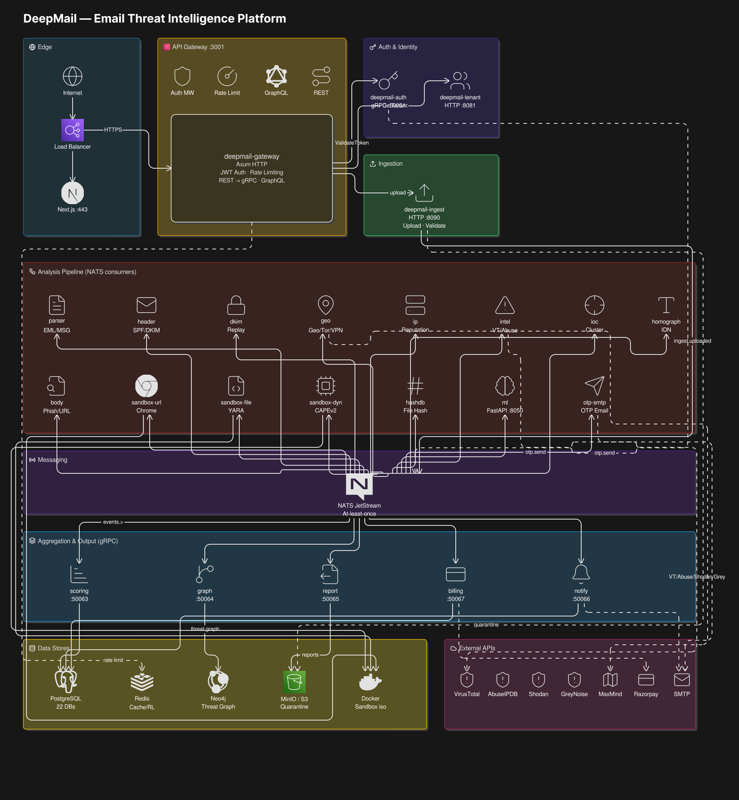

# DeepMail

DeepMail is a email threat intelligence platform. Users upload `.eml` or `.msg` samples, analyze them across multiple intelligence layers (header forensics, DKIM replay detection, geolocation, IP reputation, threat intel, IOC extraction, homograph detection, body analysis, URL/file/dynamic sandboxing, ML scoring), and the frontend presents threat reports, relationship graphs, maps, and sandbox outputs.

## Architecture




```
                                deepmail-gateway
                                        │
                    ┌─────────────────────────┐
                    │  Internal Network Only  │
                    │                         │
                    │  auth  scoring  report  │
                    │  tenant  ioc  graph     │
                    │  billing  notify        │
                    │  ingest                 │
                    │                         │
                    │  [NATS] [Redis]         │
                    │  [PostgreSQL] [Neo4j]   │
                    │  [MinIO]                │
                    └────────────────────────
```
---
## Backend Services

| Service                  | Protocol  | Responsibility                                             |
| ------------------------ | --------- | ---------------------------------------------------------- |
| **deepmail-gateway**     | HTTP      | API gateway, JWT auth, rate limiting, REST → gRPC, GraphQL |
| deepmail-auth            | gRPC      | Authentication, JWT issuance, OTP                          |
| deepmail-tenant          | HTTP      | Tenant management, Razorpay webhooks                       |
| deepmail-ingest          | HTTP      | File upload, validation, S3 quarantine                     |
| deepmail-parser          | NATS      | EML/MSG parsing                                            |
| deepmail-otp-smtp        | NATS      | OTP email delivery                                         |
| deepmail-header          | NATS      | Header forensics (SPF/DKIM/DMARC)                          |
| deepmail-dkim            | NATS      | DKIM replay detection                                      |
| deepmail-geo             | NATS      | IP geolocation, Tor/VPN detection                          |
| deepmail-ip              | NATS      | IP reputation scoring                                      |
| deepmail-intel           | NATS      | Threat intel (VirusTotal, AbuseIPDB, Shodan, GreyNoise)    |
| deepmail-ioc             | NATS      | IOC extraction & campaign clustering                       |
| deepmail-homograph       | NATS      | IDN homograph detection                                    |
| deepmail-body            | NATS      | HTML/text body analysis, phishing scoring                  |
| deepmail-sandbox-url     | NATS      | URL sandboxing (headless Chrome in Docker)                 |
| deepmail-sandbox-file    | NATS      | Static file analysis (YARA, strings, binwalk)              |
| deepmail-sandbox-dynamic | NATS      | Dynamic analysis (CAPEv2 integration)                      |
| deepmail-hashdb          | NATS      | File hash reputation                                       |
| deepmail-scoring         | gRPC      | Weighted threat score aggregation                          |
| deepmail-graph           | gRPC      | Neo4j relationship graph                                   |
| deepmail-report          | gRPC      | Report generation (JSON/HTML → S3)                         |
| deepmail-billing         | gRPC+HTTP | Usage metering, invoicing, Razorpay                        |
| deepmail-notify          | gRPC      | Alerts (email, webhook, WebSocket)                         |
| deepmail-ml              | HTTP      | Python ML inference (phishing classifier)                  |

## Quick Start

### Prerequisites

- Rust 1.75+ with `cargo`
- PostgreSQL 15+
- Redis 7+
- NATS 2.10+ with JetStream enabled
- MinIO or S3-compatible storage
- Docker (for URL sandbox)
- `sqlx-cli`: `cargo install sqlx-cli`
